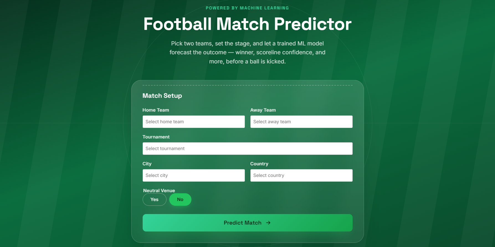
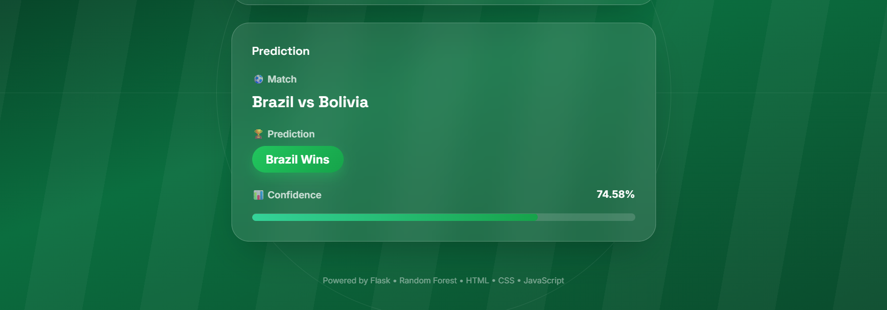

# ⚽ Football Match Predictor

A Machine Learning-powered web application that predicts the outcome of football matches using historical match data.

## 🚀 Features

- Predicts match outcome (Home Win, Away Win, Draw)
- Random Forest Machine Learning model
- Feature engineering using historical statistics
- Searchable dropdowns
- Confidence score with progress bar
- Flask backend
- Responsive modern UI

## 🛠️ Tech Stack

- Python
- Flask
- Scikit-learn
- Pandas
- NumPy
- HTML
- CSS
- JavaScript

## 📊 Machine Learning

Model Used:
- Random Forest Classifier

Feature Engineering:
- Historical average goals
- Last 5 matches average goals
- Win percentage
- Date features
  - Year
  - Month
  - Day
  - Day of Week

Model Accuracy:
- **56.3%**

## 📁 Project Structure

```
Football-Match-Predictor/
│
├── app.py
├── feature_engineering.py
├── model.pkl
├── encoders.pkl
├── requirements.txt
├── README.md
├── .gitignore
│
├── data/
│   └── results.csv
│
├── static/
│   ├── style.css
│   └── script.js
│
└── templates/
    └── index.html
```

## 📸 Screenshots

### Home Page


### Prediction


## ▶️ Installation

```bash
git clone <repository-url>

cd Football-Match-Predictor

pip install -r requirements.txt

python app.py
```

Open:

```
http://127.0.0.1:5000
```

## 🔮 Future Improvements

- XGBoost model
- Team rankings integration
- Player statistics
- Live match prediction
- Deployment with Render

## 👨‍💻 Author

Aastha Shah